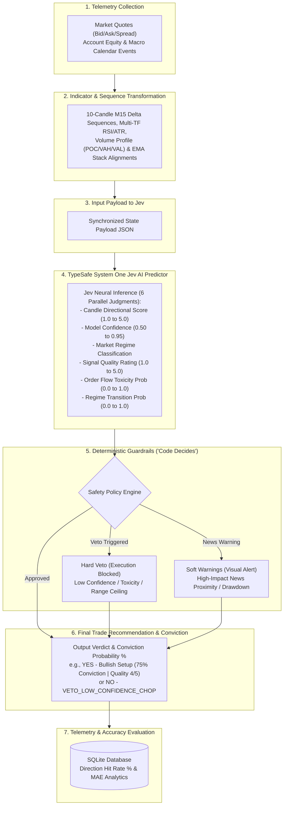

# 🧠 TypeSafe Jev System One AI Engine
> **Predictive Neural Engine & Deterministic Guardrail Policy System for Quantitative Financial Trading**

[](LICENSE)
[](https://nodejs.org/)
[](https://github.com/timnikolov)
[](https://github.com/timnikolov)

---

## 📌 Executive Overview

The **TypeSafe Jev System One AI Engine** is an enterprise-grade AI decision engine designed for high-frequency financial market prediction (US Tech 100 / USTEC Index Futures). 

In live algorithmic trading, relying solely on unstructured LLM outputs introduces critical risks: **hallucinations, non-deterministic outputs, and lack of risk control**. This project demonstrates a production-grade **Hybrid AI Architecture**: combining high-velocity neural reasoning (**TypeSafe System One Jev AI Predictor**) with deterministic safety guardrails (**Code Decides Policy Engine**).

### 🎯 Key Product Innovations
1. **Jev 6 Parallel Neural Judgments Pattern**: Instead of asking an LLM for an unstructured trade call, Jev evaluates the full market state and outputs 6 structured mathematical judgments (Directional Score, Model Confidence, Regime Classification, Signal Confluence Quality, Order Flow Toxicity Probability, and Regime Transition Probability).
2. **"Code Decides" Deterministic Policy Engine**: Jev provides neural judgments, but deterministic JavaScript policy code enforces hard vetoes (blocking execution during low confidence, high order flow toxicity, or range resistance walls).
3. **Soft vs Hard Veto Gate Layer**: Differentiates between non-negotiable execution blocks (hard vetoes) and visual risk alerts (soft warnings for macro economic news proximity and account drawdown).
4. **Brokerage-Agnostic Telemetry Ingestion**: Integrates real-time market data across trading providers (Interactive Brokers, FIX API, cTrader, Tradovate, Binance), ingesting 10-candle M15 sequences, multi-timeframe RSI/ATR analytics, Volume Profile (POC/VAH/VAL) boundaries, and EMA stack alignments into a clean input state payload.
5. **Closed-Loop Quantitative Accuracy Evaluator**: Automatically logs predictions to an embedded SQLite database and evaluates direction hit rates and Mean Absolute Error (MAE) against actual market close prices.

---

## 📐 End-to-End System Pipeline Architecture



### Complete Pipeline Trace
1. **Telemetry Collection**: Collects live market quotes (Bid, Ask, Spread) from any trading provider API, account equity/drawdown, and economic news calendar events.
2. **Indicator & Sequence Transformation**: Synchronizes 10-candle M15 price deltas, multi-timeframe RSI (M15/H1/H4/D1), Volume Profile POC/VAH/VAL walls, ATR expansion ratios, and 21/50/55/89/200 EMA stack alignments.
3. **Input Payload to Jev**: Formats all transformed indicators into a rich, structured JSON state payload.
4. **Jev Neural Inference**: **TypeSafe System One Jev AI Predictor** performs deep neural reasoning to output 6 parallel mathematical judgments.
5. **Deterministic Guardrails ("Code Decides")**: Policy rules evaluate Jev's output — triggering **Hard Vetoes** (blocking trades when confidence < 70% or toxicity >= 55%) or rendering **Soft Warnings** (visual warnings for macro news releases).
6. **Final Trade Recommendation & Conviction**: Generates final actionable verdict with continuous conviction probability % (e.g. `YES - Bullish Setup (75% Conviction | Quality 4.0/5.0)`).
7. **Telemetry & Accuracy Evaluation**: Stores prediction record in embedded SQLite DB and evaluates direction hit rate % and Mean Absolute Error (MAE) when the target candle closes.

---

## 📋 Jev 6 Parallel Neural Judgments Specification

| Judgment Field | Type | Scale / Enum | Product Definition |
|---|---|---|---|
| `candle_score` | Float | `1.0` to `5.0` | Directional conviction (`1.0` = Extreme Bear, `3.0` = Neutral, `5.0` = Extreme Bull). |
| `confidence` | Float | `0.50` to `0.95` | Jev model conviction in technical setup. |
| `regime` | Enum | `STRONG_BULL_EXPANSION` \| `STRONG_BEAR_EXPANSION` \| `RANGE_ACCUMULATION_ZONE_A` \| `HIGH_VOLATILITY_CHOP` | Market regime classification. |
| `signal_quality` | Float | `1.0` to `5.0` | Technical confluence rating across timeframes. |
| `is_market_toxic` | Float | `0.0` to `1.0` | Probability of toxic order flow / manipulative wick sweeps. |
| `is_regime_transitioning` | Float | `0.0` to `1.0` | Probability of structural regime changepoint transition. |

---

## ⚡ Quickstart & Installation

### Prerequisites
- **Node.js**: `v18.0.0` or higher
- **SQLite3**: Pre-installed on macOS / Linux (`sqlite3` CLI)

### 1. Clone Repository & Install Dependencies
```bash
git clone https://github.com/timnikolov/jev-system-one-ai-engine.git
cd jev-system-one-ai-engine
npm install
```

### 2. Configure Environment (Optional)
Copy `config.example.json` to `config.json` to supply your configuration:
```bash
cp config.example.json config.json
```
*Note: If no remote/local LLM endpoint is active, Jev automatically utilizes its built-in calibrated quantitative fallback predictor.*

---

## 🚀 Runnable Demos

### Run Standalone System One Prediction Demo
```bash
npm run demo
```
*Outputs complete Jev 6-judgment neural inference, state snapshot, soft warnings, policy verdict, and trade recommendation.*

### Test Deterministic Policy Guardrails Suite
```bash
npm run test:policy
```
*Demonstrates hard veto triggers (low confidence, ADR exhaustion overstretch) vs visual soft gate warnings (CPI news freeze, drawdown alert).*

### Start REST API Server
```bash
npm start
```
Starts Express server on `http://localhost:3000`.

---

## 📡 REST API Reference & Schemas

### `POST /api/v1/predict`
Executes System One Jev prediction and policy evaluation against provided market state telemetry.

**Request Payload Example (`TelemetryInputState`):**
```json
{
  "symbol": "USTEC",
  "quote": {
    "bid": 19850.50,
    "ask": 19851.50,
    "spread": 10.0,
    "rsi": 68.4,
    "macd": 12.5
  },
  "positionsAnalysis": {
    "atr": 42.5
  },
  "recentCloses": [19810, 19815.5, 19822, 19828.4, 19835, 19832.1, 19840, 19844.5, 19848, 19850.5],
  "rsiSequence": [52.0, 54.5, 57.1, 60.2, 62.8, 64.0, 65.5, 66.8, 67.9, 68.4],
  "account": {
    "balance": 25000.0,
    "equity": 24850.0
  },
  "macroEvents": [
    { "title": "US Core CPI YoY", "time": "14:30", "impact": "HIGH" }
  ]
}
```

**Response Payload Example (`PredictionResultPayload`):**
```json
{
  "success": true,
  "prediction": {
    "timestamp": "2026-09-20T21:30:00.000Z",
    "timeframe": "M15",
    "predictedScore": 4.2,
    "predictedDirection": "BULLISH_UP",
    "predictedMagnitude": "MODERATE_EXPANSION",
    "predictedDeltaRange": "+26 to +77 pts",
    "marketRegime": "STRONG_BULL_EXPANSION",
    "confidence": 0.88,
    "signalQualityScore": 4.0,
    "marketToxicityProb": 0.15,
    "regimeTransitionProb": 0.20,
    "policyVerdict": "APPROVED_TRADE_EXECUTION",
    "policyGateReason": "High Confluence Setup Passed",
    "isTradeVetoed": false,
    "actionableSetup": "YES - Bullish Setup (75% Conviction | Quality 4.0/5.0)",
    "softGateWarnings": "NEWS: HIGH_IMPACT_NEWS_PROXIMITY (US Core CPI YoY)",
    "predictionSource": "LOCAL_LLM_QWEN",
    "startPrice": 19850.5,
    "targetCloseTimestamp": 1789932600000
  },
  "accuracyStats": {
    "totalEvaluated": 124,
    "directionHitRatePct": 74.2,
    "meanAbsoluteErrorPts": 14.8
  }
}
```

### `GET /api/v1/accuracy`
Retrieves quantitative hit rate % and Mean Absolute Error (MAE) statistics from SQLite DB.

---

## 📑 Project Structure

```
jev-system-one-ai-engine/
├── docs/
│   └── ARCHITECTURE.md          # Technical Architecture & System Specification
├── examples/
│   ├── run_prediction.js        # Executable System One Demo Script
│   └── test_policy_engine.js    # Policy Veto & Soft Warnings Test Suite
├── src/
│   ├── database.js              # SQLite Telemetry Persistence & Evaluator
│   ├── index.js                 # Express REST API Server
│   ├── llm_engine.js            # Multi-Provider Routing
│   ├── predictor.js            # System One AI Predictor & Deterministic Policy Engine
│   └── types.js                 # JSDoc Schema & Type Definitions
├── .gitignore                   # Git Ignore Specification
├── config.example.json          # Sanitized Configuration Template
├── package.json                 # ES Module Package Spec
└── README.md                    # Executive AI PM Portfolio Documentation (@timnikolov)
```

---

## 🛠️ AI Product Manager (AI PM) Portfolio Context

**Author**: Tim Nikolov ([@timnikolov](https://github.com/timnikolov))  
**Domain**: Quantitative Trading Systems, Generative AI Systems, Deterministic Safety Guardrails  
**Product Strategy Highlights**:
- **Risk Mitigation**: Replaced open-ended prompt generation with structured JSON schema constraints to eliminate hallucinated parameters.
- **Safety First**: Decoupled LLM reasoning from trade execution. Jev's neural judgments inform, but deterministic code policies decide.
- **Measurable Impact**: Embedded closed-loop quantitative evaluation directly in the DB schema to track model performance against ground-truth market outcomes.

---

## 📄 License

This repository is licensed under the [MIT License](LICENSE).
