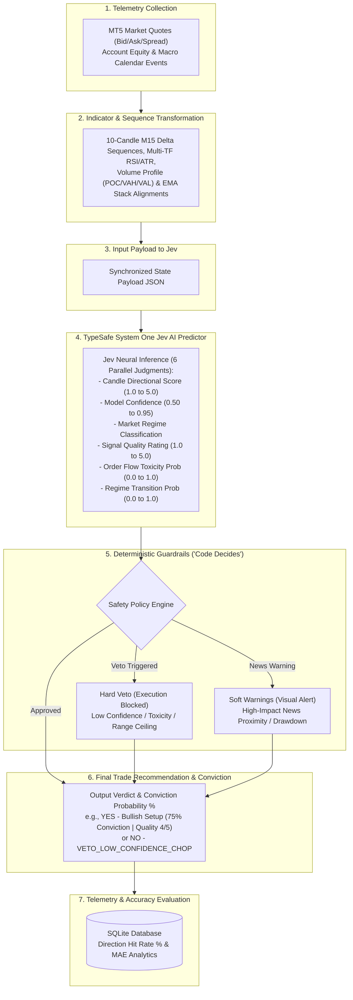

# 🏗️ Technical Architecture & AI System Specification

**TypeSafe Jev System One AI Engine** — Predictive Neural Engine & Deterministic Policy Guardrail System for High-Frequency Quantitative Trading.

---

## 1. Executive Summary & Design Philosophy

Traditional machine learning implementations in quantitative trading often fail due to **probabilistic non-stationarity** and **LLM hallucination risk**. When an autonomous AI system makes unconstrained trading decisions directly from unstructured prompts, it suffers from catastrophic risk exposure during volatile or black-swan market regimes.

To solve this, the **TypeSafe Jev System One AI Engine** enforces a **Hybrid Dual-Engine Pattern**:



---

## 2. Complete System Pipeline Breakdown

1. **Step 1: Telemetry Collection (`TelemetryInputState`)**
   - Collects real-time market quotes (Bid, Ask, Spread), MT5 live account balance/equity/margin, and macro economic news events.
2. **Step 2: Indicator & Sequence Transformation**
   - Transforms raw ticks into 10-candle M15 price deltas, multi-timeframe RSI (M15/H1/H4/D1), Volume Profile (POC/VAH/VAL) support/resistance walls, ATR expansion ratios, and 21/50/55/89/200 EMA stack alignments.
3. **Step 3: State Payload Synthesis**
   - Compiles all transformed indicators and sequence analytics into a clean, type-safe state JSON payload.
4. **Step 4: TypeSafe System One Jev AI Predictor (`askSystemOneJev`)**
   - **Jev** evaluates the full market state and outputs 6 parallel structured judgments: Directional Score, Model Confidence, Market Regime, Signal Quality Rating, Order Flow Toxicity Probability, and Regime Transition Probability.
5. **Step 5: Deterministic Policy Engine ("Code Decides")**
   - Evaluates safety rules against Jev's output — triggering **Hard Vetoes** (blocking execution when confidence < 70%, toxicity >= 55%, or range walls are hit) or rendering **Soft Warnings** (visual warning cards for macro news releases).
6. **Step 6: Final Trade Recommendation & Conviction Output**
   - Generates the final actionable recommendation with continuous conviction probability % (e.g. `YES - Bullish Setup (75% Conviction | Quality 4.0/5.0)` or `NO - VETO_LOW_CONFIDENCE_CHOP`).
7. **Step 7: Closed-Loop Telemetry & Accuracy Evaluation (`database.js`)**
   - Logs prediction records in embedded SQLite DB and measures Direction Hit Rate % and Mean Absolute Error (MAE) against target candle close prices.

---

## 3. Jev 6 Parallel Neural Judgments Specification

Instead of requesting an unstructured text summary or a single binary trade decision, Jev is queried for **6 parallel structured judgments**:

| Judgment Symbol | Data Type | Scale / Enum | Product Definition & Purpose |
|---|---|---|---|
| `candle_score` | Continuous Score | `1.0` - `5.0` | Directional conviction for the next M15 candle (`1.0` = Extreme Bear, `3.0` = Neutral, `5.0` = Extreme Bull). |
| `confidence` | Probability | `0.50` - `0.95` | Jev model's statistical certainty in its technical assessment. |
| `regime` | Categorical | `STRONG_BULL_EXPANSION` \| `STRONG_BEAR_EXPANSION` \| `RANGE_ACCUMULATION_ZONE_A` \| `HIGH_VOLATILITY_CHOP` | Active macro/micro market environment classification. |
| `signal_quality` | Rating Score | `1.0` - `5.0` | Technical confluence rating evaluating structural alignment across indicators. |
| `is_market_toxic` | Probability | `0.0` - `1.0` | Probability of order book toxicity, erratic chop, or institutional manipulative sweeps. |
| `is_regime_transitioning` | Probability | `0.0` - `1.0` | Probability of structural regime changepoint (breakout vs fakeout transition). |

---

## 4. Deterministic Safety Matrix: Hard Vetoes vs Visual Soft Warnings

### Hard Veto Matrix (Execution Blocked)
1. **Low Confidence Cutoff**: If `confidence < 0.70`, verdict set to `VETO_LOW_CONFIDENCE_CHOP`.
2. **Poor Signal Quality**: If `signal_quality < 3.0/5.0`, verdict set to `VETO_POOR_SIGNAL_QUALITY`.
3. **Toxic Order Flow**: If `is_market_toxic >= 0.55`, verdict set to `VETO_TOXIC_ORDER_FLOW`.
4. **Volume Profile Range Wall Resistance**: If `predictedScore >= 3.5` but price is at 4H Range Ceiling (`rangeLocationPct >= 96%`) without extreme confluence (`signal_quality < 4.5`), verdict set to `VETO_RANGE_CEILING_WALL`.
5. **Intraday Range Exhaustion**: If `predictedScore >= 3.5` and `adrExhaustionPct >= 130%`, verdict set to `VETO_ADR_EXHAUSTION_OVERSTRETCH`.

### Visual Soft Warnings (Non-Blocking)
1. **Economic News Proximity**: Imminent high-impact news releases (CPI, NFP, FOMC) render visual warning cards in the user UI (`pre_news_freeze_window: true`), allowing the user to observe market reaction without hard-blocking valid technical setups.
2. **Account Drawdown Warning**: Drawdown warning thresholds (`current_drawdown_pct >= 3.5%`) are displayed visually to highlight open risk.

---

## 5. Standardized Telemetry Schema & Payload Specification

### Canonical Input Telemetry Schema (`TelemetryInputState`)
```json
{
  "symbol": "USTEC",
  "quote": {
    "bid": 19850.50,
    "ask": 19851.50,
    "spread": 10.0,
    "rsi": 68.4,
    "macd": 12.5
  },
  "positionsAnalysis": {
    "atr": 42.5
  },
  "recentCloses": [19810, 19815.5, 19822, 19828.4, 19835, 19832.1, 19840, 19844.5, 19848, 19850.5],
  "rsiSequence": [52.0, 54.5, 57.1, 60.2, 62.8, 64.0, 65.5, 66.8, 67.9, 68.4],
  "account": {
    "balance": 25000.0,
    "equity": 24850.0
  },
  "macroEvents": [
    { "title": "US Core CPI YoY", "time": "14:30", "impact": "HIGH" }
  ]
}
```

### Canonical Output Prediction Payload (`PredictionResultPayload`)
```json
{
  "timestamp": "2026-09-20T21:30:00.000Z",
  "timeframe": "M15",
  "predictedScore": 4.2,
  "predictedDirection": "BULLISH_UP",
  "predictedMagnitude": "MODERATE_EXPANSION",
  "predictedDeltaRange": "+26 to +77 pts",
  "marketRegime": "STRONG_BULL_EXPANSION",
  "confidence": 0.88,
  "signalQualityScore": 4.0,
  "marketToxicityProb": 0.15,
  "regimeTransitionProb": 0.20,
  "policyVerdict": "APPROVED_TRADE_EXECUTION",
  "policyGateReason": "High Confluence Setup Passed",
  "isTradeVetoed": false,
  "actionableSetup": "YES - Bullish Setup (75% Conviction | Quality 4.0/5.0)",
  "softGateWarnings": "NEWS: HIGH_IMPACT_NEWS_PROXIMITY (US Core CPI YoY)",
  "predictionSource": "LOCAL_LLM_QWEN",
  "startPrice": 19850.5,
  "targetCloseTimestamp": 1789932600000
}
```

